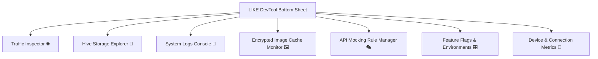

# like_devtool 🛠️

`like_devtool` is the official, premium, and **production-safe** developer tooling panel for the [like](https://pub.dev/packages/like) networking ecosystem. It injects a highly responsive, draggable floating action button (FAB) into your Flutter application tree, opening a feature-rich, beautiful debug bottom sheet that empowers developers with real-time network, storage, caching, and logging insights.

---

## ⚡ 100% Production-Safe (Zero Overhead)
`like_devtool` is architected with advanced build safety in mind. 
* By default, it detects `kReleaseMode` and **short-circuits at compile time**, completely stripping the devtool overlay, assets, controllers, and tracking code from your release binaries.
* This guarantees **zero runtime penalty**, zero CPU overhead, and zero security risk of exposing internal endpoints, database keys, or feature flags to end-users in production.

---

## 🏗️ Deep Feature Ecosystem (7 Powerful Panels)

`like_devtool` divides developer controls into **7 beautifully animated, context-rich panels**:



### 1. Traffic Inspector 🌐
* **Real-time API Capture**: Tracks active and completed REST, HTTP, or simulation request chains initiated by `LikeClient`.
* **Deep Inspect**: Drill down into requests to inspect HTTP methods, status codes, query parameters, authorization headers, and raw JSON request/response payloads.

### 2. Storage Explorer 💾
* **Hive Database Viewer**: Live connection to the local persistent Hive boxes (`like_api_cache`, `like_offline_queue`, `like_cache_metadata`, `like_etags`).
* **Active Entry Inspection**: Browse and inspect key-value pairs representing stored cache results, expiration metadata, and active offline synchronization tasks.
* **One-Tap Flush**: Instantly clear specific caching boxes to force live API updates during testing.

### 3. System Logs Console 📝
* **Internal Event Tracing**: Stream and record internal logging output, warning diagnostics, custom developer events, and connectivity transition states.
* **Filter and Export**: Filter logs in real-time to isolate networking warnings from pure layout logs.

### 4. Encrypted Image Cache Monitor 🖼️
* **Stats & Space Tracking**: Real-time monitoring of disk storage utilized by the secure, AES-CBC 256-bit encrypted `LikeCacheImage` subsystem.
* **Total File Count & Active MB**: See exactly how many items are currently cached and the total space on disk.
* **Manual Cache Purging**: Erase local image caches with a single tap to trigger re-downloads and decrypt validations.

### 5. API Mocking Rule Manager 🎭
* **Visual Mocking Rules**: View and toggle custom `MockRule`s registered via the `MockController`.
* **API Simulation Control**: Inspect which path patterns are being intercepted, simulate custom HTTP error statuses (e.g. 500, 429, 403), and preview simulated JSON payloads.


---
## 🛠️ Getting Started

### 1. Add Dependencies
By default, you can add `like_devtool` to your `dependencies` section.

```yaml
dependencies:
  flutter:
    sdk: flutter
  like: ^1.1.1
  like_devtool: ^1.0.1
```

### 2. Initialize in `Like` Root Wrapper
Pass the `LikeDevTool` as the `devTool` builder function argument inside the top-level `Like` wrapper:

```dart
import 'package:flutter/material.dart';
import 'package:like/like.dart';
import 'package:like_devtool/like_devtool.dart';

void main() {
  runApp(
    Like(
      baseUrl: 'https://api.example.com',
      getToken: () async => 'session_jwt_token',
      // Injects the devtool button and bottom sheet in debug/profile builds:
      devTool: (child) => LikeDevTool(child: child),
      child: const MyApp(),
    ),
  );
}
```

---

## 🛡️ Production Stripping & Zero-Dependency Setup

If you want to **strictly enforce that `like_devtool` is only included during development** and completely omitted from your production codebase (e.g. to keep it under `dev_dependencies` rather than `dependencies`), follow one of these clean production architectures:

### Option A: Conditional Initialization (Recommended)
This approach allows the compiler to fully tree-shake `like_devtool` in release builds while maintaining a single, clean `main.dart` entrypoint.

```dart
import 'package:flutter/foundation.dart';
import 'package:flutter/material.dart';
import 'package:like/like.dart';
import 'package:like_devtool/like_devtool.dart';

void main() {
  runApp(
    Like(
      baseUrl: 'https://api.example.com',
      getToken: () async => 'session_jwt_token',
      // Only wrap with the devtool in debug/profile modes. 
      // In release mode, devTool is null and completely stripped.
      devTool: kReleaseMode ? null : (child) => LikeDevTool(child: child),
      child: const MyApp(),
    ),
  );
}
```

### Option B: Separate Entrypoints (Zero-Imports in Release)
If you want to keep `like_devtool` strictly in `dev_dependencies` and avoid importing it in your main production file at all:

1. Add `like_devtool` under `dev_dependencies` in your `pubspec.yaml`:
   ```yaml
   dependencies:
     like: ^1.1.1

   dev_dependencies:
     like_devtool: ^1.0.1
   ```

2. Create a development-only entrypoint: **`lib/main_dev.dart`**:
   ```dart
   import 'package:flutter/material.dart';
   import 'package:like/like.dart';
   import 'package:like_devtool/like_devtool.dart';
   import 'main.dart' as prod;

   void main() {
     prod.devToolBuilder = (child) => LikeDevTool(child: child);
     prod.main();
   }
   ```

3. Keep your production entrypoint **`lib/main.dart`** completely clean:
   ```dart
   import 'package:flutter/material.dart';
   import 'package:like/like.dart';

   // Global builder variable overridden only by main_dev.dart
   Widget Function(Widget child)? devToolBuilder;

   void main() {
     runApp(
       Like(
         baseUrl: 'https://api.example.com',
         getToken: () async => 'session_jwt_token',
         devTool: devToolBuilder, // Will be null in production
         child: const MyApp(),
       ),
     );
   }
   ```

4. Run your application during development using the development entrypoint:
   ```bash
   flutter run -t lib/main_dev.dart
   ```

---

## 🎨 Premium Theme Customization

`like_devtool` comes with a stunning UI built on high-contrast dark modes, glassmorphism, and hardware-accelerated layouts (utilizing `SnapshotWidget` to eliminate unnecessary UI layout and paint passes).

You can easily override the default dark teal theme using custom color palettes or our built-in preset configurations:

```dart
LikeDevTool(
  initialTheme: LikeDevToolThemeData.neonPurple, // Preset
  child: MyApp(),
)
```

### Available Presets
*   `LikeDevToolThemeData.darkTeal` (Default - sleek, premium modern dark)
*   `LikeDevToolThemeData.amberGold` (Warm, high-contrast, gold-accented)
*   `LikeDevToolThemeData.neonPurple` (Vibrant neon dark mode)
*   `LikeDevToolThemeData.sakuraPink` (Soft dark pink theme)
*   `LikeDevToolThemeData.cleanLight` (Impeccable, highly-scannable light mode)

### Defining a Custom Color Palette
Create your own `LikeDevToolThemeData` to align with your corporate brand:

```dart
const myBrandTheme = LikeDevToolThemeData(
  primary: Color(0xFF6366F1),        // Indigo
  background: Color(0xFF0B0F19),     // Deep Obsidian Navy
  cardBackground: Color(0xFF111827), // Midnight Gray
  inputBackground: Color(0xFF1F2937),// Slate Gray
  textColor: Colors.white,pipelineEndpoint: '/users',      // ← required for pipeline matching
    pipelineMapper: (json) =>        // ← optional: auto-update from other screens
        (json as List).map((e) => User.fromJson(e)).toList(),
);

LikeDevTool(
  initialTheme: myBrandTheme,
  child: MyApp(),
)
```

---

## ⚙️ Advanced Build Configurations

### Dynamic Environment Controls
By default, the developer panel is enabled for all **Debug** and **Profile** builds, and fully compiled out in **Release** builds.

If you wish to force-include or force-exclude devtools in specific configurations, override the `INCLUDE_DEVTOOLS` compiler define during your flutter builds:

#### Force Enable in Release Builds (for private internal test flights)
```bash
flutter build apk --dart-define=INCLUDE_DEVTOOLS=true
```

#### Force Strip in Profile Builds (for pure performance benchmarking)
```bash
flutter build apk --profile --dart-define=INCLUDE_DEVTOOLS=false
```

---

## 🤝 Connect & Support

Support the development or collaborate with us:

- **GitHub Repository**: [@AjayJasperJ](https://github.com/AjayJasperJ)
- **LinkedIn**: [Ajay Jasper J](https://in.linkedin.com/in/ajay-jasper-j-8563852b4)
- **Instagram**: [@ajayjasper.j](https://www.instagram.com/ajayjasper.j)
- **Email**: [ajayjasperj@outlook.com](mailto:ajayjasperj@outlook.com)
